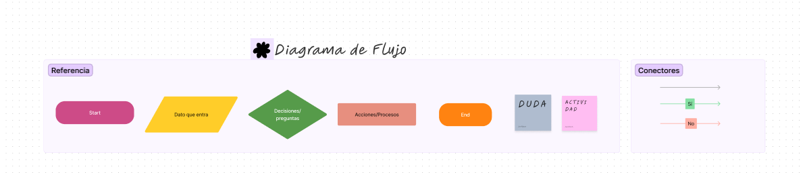
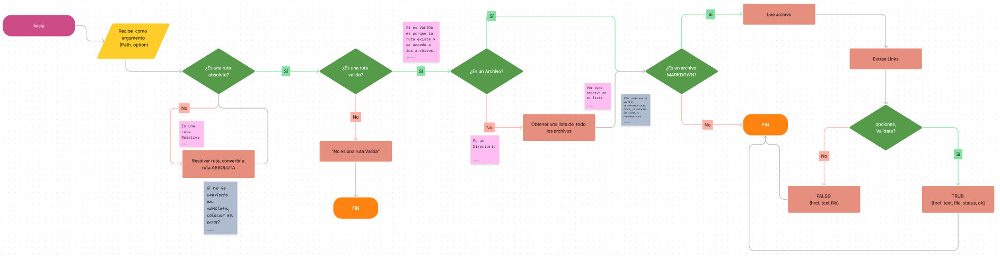
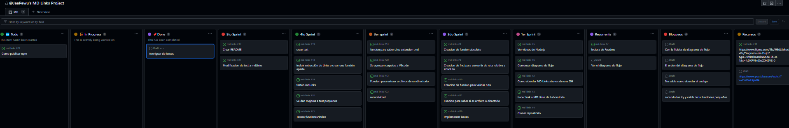
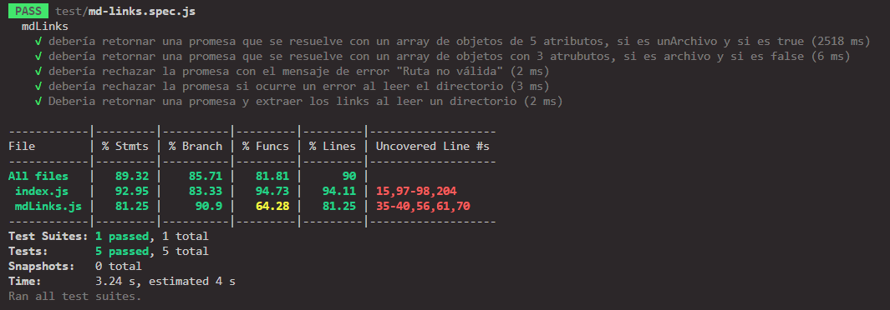
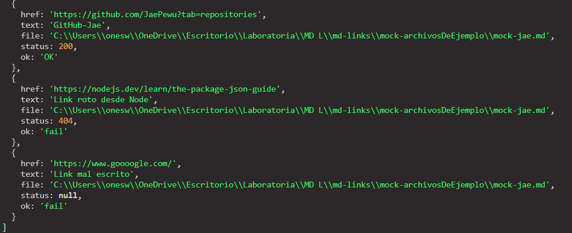

# Markdown Links

## Índice

* [1. Preámbulo](#1-preámbulo)
* [2. 🌟 Resumen del proyecto](#2-resumen-del-proyecto)
* [3. Consideraciones generales](#3-consideraciones-generales)
* [4. Diagrama de flujo](#4-Diagrama-de-flujo)
* [5. Planificación y testeo](#5-Planificación-y-testeo)
* [6. Entregables](#6-entregables)
* [6. Paso a Paso del Proyecto](#6-Paso-a-Paso-del-Proyecto)
* [7. Checklist General](#7-Checklist-General)

***

## 1. Preámbulo

[Markdown](https://es.wikipedia.org/wiki/Markdown) es un lenguaje de marcado
ligero muy popular entre developers. Es usado en muchísimas plataformas que
manejan texto plano (GitHub, foros, blogs, ...) y es muy común
encontrar varios archivos en ese formato en cualquier tipo de repositorio
(empezando por el tradicional `README.md`).

Estos archivos `Markdown` normalmente contienen _links_ (vínculos/ligas) que
muchas veces están rotos o ya no son válidos y eso perjudica mucho el valor de
la información que se quiere compartir.


## 2. 🌟 Resumen del proyecto

En este proyecto cree mí propia librería (o biblioteca - library) en JavaScript.

En esta oportunidad nos alejamos un poco del navegador para construir un
programa que se ejecute usando Node.js.

[Node.js](https://nodejs.org/es/) es un entorno de ejecución para JavaScript
construido con el [motor de JavaScript V8 de Chrome](https://developers.google.com/v8/).
Esto nos va a permitir ejecutar JavaScript en el entorno del sistema operativo,
ya sea tu máquina o un servidor, lo cual nos abre las puertas para poder
interactuar con el sistema en sí, archivos, redes, etc.


## 3. Consideraciones generales
### 3.1 Archivos del proyecto

* `README.md` 
* `index.js`: Desde este archivo se debe exportar **una** función (`mdLinks`).
* `package.json` con nombre, versión, descripción, autores, licencia,
  dependencias, scripts (pretest, test, ...), main, bin
* `.editorconfig` con configuración para editores de texto. Este archivo no se
  debe cambiar.
* `.eslintrc` con configuración para linter. Este archivo contiene una
  configuración básica para ESLint.
* `.gitignore` para ignorar `node_modules` u otras carpetas que no deban
  incluirse en control de versiones (`git`).
* `test/md-links.spec.js` debe contener los tests unitarios para la función
  `mdLinks()`. La implementación debe pasar estos tests.


### 3.2  `mdLinks(path, options)`

##### Argumentos

* `path`: Ruta **absoluta** o **relativa** al **archivo** o **directorio**.
Si la ruta pasada es relativa, debe resolverse como relativa al directorio
desde donde se invoca node - _current working directory_).
* `options`: Un objeto con **únicamente** la siguiente propiedad:
  - `validate`: Booleano que determina si se desea validar los links
    encontrados.

##### Valor de retorno

La función debe **retornar una promesa** (`Promise`) que **resuelva a un arreglo**
(`Array`) de objetos (`Object`), donde cada objeto representa un link y contiene
las siguientes propiedades

Con `validate:false` :

* `href`: URL encontrada.
* `text`: Texto que aparecía dentro del link (`<a>`).
* `file`: Ruta del archivo donde se encontró el link.

Con `validate:true` :

* `href`: URL encontrada.
* `text`: Texto que aparecía dentro del link (`<a>`).
* `file`: Ruta del archivo donde se encontró el link.
* `status`: Código de respuesta HTTP.
* `ok`: Mensaje `fail` en caso de fallo u `ok` en caso de éxito.


#### Options

##### `--validate`

Si pasamos la opción `--validate`, el módulo debe hacer una petición HTTP para
averiguar si el link funciona o no. Si el link resulta en una redirección a una
URL que responde ok, entonces consideraremos el link como ok.

Por ejemplo:

```sh
$ md-links ./some/example.md --validate
./some/example.md http://algo.com/2/3/ ok 200 Link a algo
./some/example.md https://otra-cosa.net/algun-doc.html fail 404 algún doc
./some/example.md http://google.com/ ok 301 Google
```

Vemos que el _output_ en este caso incluye la palabra `ok` o `fail` después de
la URL, así como el status de la respuesta recibida a la petición HTTP a dicha
URL.

### 3.3  Sugerencias de implementación

La implementación de este proyecto tiene varias partes: leer del sistema de
archivos, recibir argumentos a través de la línea de comando, analizar texto,
hacer consultas HTTP, ... y todas estas cosas pueden enfocarse de muchas formas,
tanto usando librerías como implementando en VanillaJS.

Por poner un ejemplo, el _parseado_ (análisis) del markdown para extraer los
links podría plantearse de las siguientes maneras (todas válidas):

* Usando un _módulo_ como [markdown-it](https://github.com/markdown-it/markdown-it),
  que nos devuelve un arreglo de _tokens_ que podemos recorrer para identificar
  los links.
* Siguiendo otro camino completamente, podríamos usar
  [expresiones regulares (`RegExp`)](https://developer.mozilla.org/es/docs/Web/JavaScript/Guide/Regular_Expressions).

## 4. Diagrama de flujo

Este proyecto es distinto a los que he trabajo hasta ahora dado que no hay una interfaz
web, todo se desarrolla en mi editor y terminal/consola.

Es por ello que, para visualizar mejor lo que debía hacer
y planificar, como recomendación nos hicieron crear un
`diagrama de flujo`.




## 5. Planificación y testeo

### GitHub Project

Esta vez la planificación fue a través de GitHub Project.



### Test



### Validación en TRUE



### Validación en FALSE


## 6. Paso a Paso del Proyecto

### Lee un archivo

Como primer reto, puedes tratar de leer un solo archivo con
una ruta fija e imprimir su contenido en la consola con un `console.log`.

La librería nativa `FS` (FileSystem) te será de utilidad.

**Recuerda**: Te sugerimos **no utilizar** la versión síncrona
de la función para leer archivos, `readFileSync`, y en cambio
intentar resolver ese desafío de manera asíncrona.

### Averigua la extensión de un archivo

Ya sabiendo leer un archivo, aventúrate a conocer cual
es su extensión.

Recuerda, las extensiones son esas letras al final del
nombre de un archivo, por ejemplo: .js, .txt, .doc, etc

Aquí también podrá ser útil `FS`.

### Obtén el contenido de un directorio

Este proyecto consiste en buscar archivos, pero para eso,
primero debes poder verlos.

Intenta imprimir en consola la lista de archivos en una carpeta.

La librería `FS` también te será útil aquí.

**Recuerda**: Para disminuir la complejidad de tu algoritmo
recursivo, te recomendamos utilizar la versión síncrona de
la función para leer directorios, `readdirSync`.

### Une dos rutas

Para poder acceder a carpetas y archivos será necesario que
indiques en qué lugar de tu computadora se encuentran, a esto
le llamamos **rutas**.

Usa la librería nativa `path` para unir dos segmentos de ruta,
por ejemplo, si queremos unir:

1) /home/Laboratoria/
2) ./test

El resultado sería: /home/Laboratoria/test

### Recursividad

Este proyecto se ha de resolver de forma casi natural con
**recursividad**.

¿Por qué?.

Porque no conocemos realmente cuantas carpetas y archivos
tendremos que recorrer antes de terminar.

Si recibes una ruta de carpeta, no sabrás de ante mano si
dentro hay más carpetas o muchos archivos.

### Crea una promesa

El valor de retorno de nuestra librería es una `Promesa`,
no un `Array`.


## 7. Checklist General

* [x] El módulo exporta una función con la interfaz (API) esperada.
* [x] Implementa soporte para archivo individual
* [x] Implementa soporte para directorios
* [x] Implementa `options.validate`
* [x] Expone ejecutable `md-links` en el path (configurado en `package.json`)
* [x] Se ejecuta sin errores / output esperado
* [x] Implementa `--validate`
* [x] Pruebas unitarias cubren un mínimo del 70% de statements, functions,
  lines, y branches.
* [x] Pasa tests(`npm test`).
